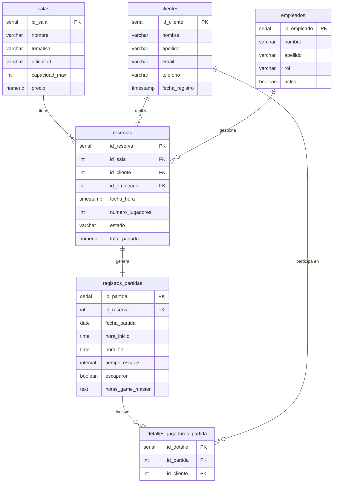

# Proyecto 2- Grupo Nro. 3: Scape Rooms

## Se generan las siguientes tablas en el proyecto (ver archivo script_tablas_BBDD.sql para mayor detalle):

* salas
* clientes
* empleados
* reservas
* registros_partidas
* detalle_jugadores_partida

## 🗺️ Mapa de Relaciones (Cardinalidad)

| Tabla origen | Relación | Descripción | Tipo FK |
|:---|:---:|:---|:---:|
| `reservas` → `salas` | N : 1 | Una sala puede tener muchas reservas | `ON DELETE RESTRICT` |
| `reservas` → `clientes` | N : 1 | Un cliente puede tener muchas reservas | `ON DELETE CASCADE` |
| `reservas` → `empleados` | N : 1 | Un empleado puede gestionar muchas reservas | `ON DELETE SET NULL` |
| `registros_partidas` → `reservas` | 1 : 1 | Una reserva genera exactamente una partida | `ON DELETE CASCADE` |
| `detalles_jugadores_partida` → `registros_partidas` | N : 1 | Una partida puede tener muchos jugadores registrados | `ON DELETE CASCADE` |
| `detalles_jugadores_partida` → `clientes` | N : 1 | Un cliente puede participar en muchas partidas | `ON DELETE CASCADE` |

## Diagrama ER:

