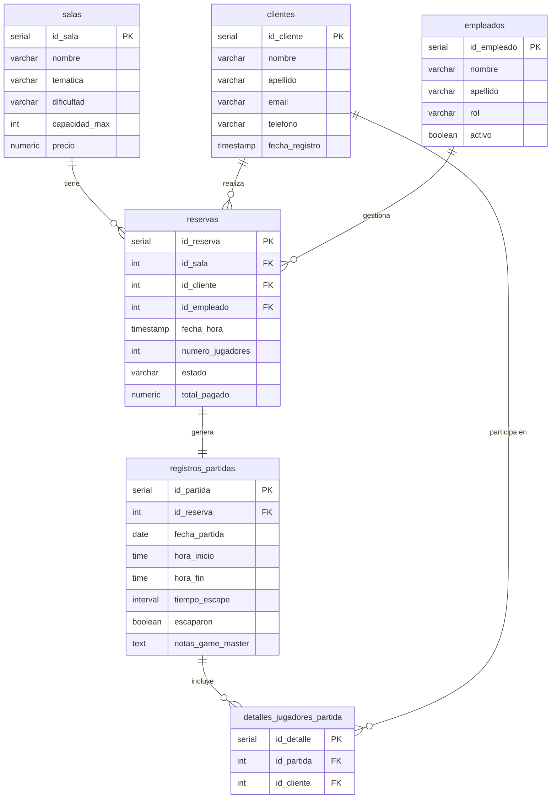

# Proyecto 2 - Grupo 3: Sistema de Gestion para Escape Rooms

## Descripcion

Este proyecto consiste en el desarrollo de una API REST para la gestion integral de un negocio de escape rooms.

La aplicacion tiene como objetivo digitalizar y centralizar procesos operativos que habitualmente se gestionan de forma manual o mediante herramientas no integradas, como WhatsApp, Excel, llamadas telefonicas, agendas o notas internas.

El sistema permitira gestionar reservas, clientes, salas, empleados, partidas y jugadores, facilitando una administracion mas organizada, trazable y escalable del negocio.

## Contexto de negocio

El proyecto toma como referencia operativa negocios reales del sector, como The Hive Escape Room:

https://thehive.barcelona/

En muchos escape rooms pequenos y medianos, la gestion diaria depende todavia de procesos manuales o soluciones parciales. Esto puede provocar problemas como:

- Dobles reservas.
- Errores en la disponibilidad.
- Perdida de informacion.
- Dificultad para gestionar cancelaciones.
- Falta de trazabilidad operativa.
- Mala organizacion de clientes y grupos.
- Problemas en la gestion de pagos o senales.
- Dificultad para obtener metricas reales del negocio.

Aunque existen plataformas especializadas en el sector, como Escape Up o 4Escape, muchas de estas soluciones estan centradas principalmente en motores de reserva y pueden resultar rigidas para ciertas necesidades operativas.

Este proyecto propone una arquitectura mas flexible y personalizada, orientada no solo a gestionar sesiones, sino tambien a mantener informacion estructurada sobre clientes, reservas, salas, empleados, partidas y participantes.

Para consultar el analisis completo del contexto de negocio, ver:

[docs/business-context.md](docs/business-context.md)

## Objetivo del proyecto

Desarrollar una API REST con base de datos relacional que permita gestionar de forma eficiente un negocio de escape rooms.

El sistema busca cumplir los requisitos tecnicos del briefing academico:

- Diseno de base de datos SQL.
- API REST con operaciones CRUD.
- Documentacion de la API.
- Tests unitarios y de integracion.
- Control de versiones con Git y GitHub.
- Gestion del proyecto mediante SCRUM en Jira.
- Documentacion del proceso de trabajo.

## Metodologia de trabajo

El proyecto se gestiona mediante metodologia SCRUM utilizando Jira.

Se han definido dos sprints principales:

| Sprint | Fechas | Objetivo |
|---|---|---|
| Sprint 1 - MVP Esencial | 25/05/2026 - 29/05/2026 | Construir un primer MVP funcional que cumpla el Nivel Esencial del briefing. |
| Sprint 2 - Mejora, Experto y Cierre | 01/06/2026 - 04/06/2026 | Anadir mejoras de Nivel Medio, Avanzado y Experto, reforzar tests, documentacion y preparar la entrega final. |

Tablero Jira del proyecto:

https://miguel-redondo.atlassian.net/jira/software/projects/P2G3S/boards/34/backlog

La documentacion SCRUM del proyecto se encuentra en:

```text
docs/scrum/
```

Las dailys se documentan en:

```text
docs/scrum/dailys/
```

## Tecnologias previstas

Las tecnologias principales del proyecto son:

- Python.
- FastAPI.
- Base de datos SQL.
- SQLAlchemy o equivalente ORM.
- Swagger/OpenAPI para documentacion interactiva.
- Pytest para testing.
- Git y GitHub para control de versiones.
- Jira para gestion SCRUM.
- Docker como objetivo de Nivel Experto.

## Estructura del proyecto

La estructura inicial del proyecto se plantea separando responsabilidades por capas para facilitar el trabajo en equipo y reducir conflictos durante el desarrollo.

```text
backend/
├── controllers/
│   └── game_controller.py
├── core/
│   ├── config.py
│   ├── constants.py
│   └── database.py
├── models/
├── schemas/
│   └── messages.py
├── services/
│   ├── elevenlabs_service.py
│   └── ws_manager.py
├── .env.example
├── Dockerfile
├── main.py
├── requirements.txt
└── test_ws.py

frontend/
```

### Criterio de organizacion

- `controllers/`: gestion de rutas y controladores de la API.
- `core/`: configuracion principal, constantes y conexion con base de datos.
- `models/`: modelos de datos y entidades principales.
- `schemas/`: validacion y estructura de datos de entrada y salida.
- `services/`: logica de negocio y servicios externos.
- `main.py`: punto de entrada de la aplicacion.
- `.env.example`: plantilla de variables de entorno necesarias para ejecutar el proyecto.
- `Dockerfile`: configuracion para contenedorizacion.
- `frontend/`: espacio reservado para una posible interfaz basica.

El archivo `.env` se utilizara solo en local y no debe subirse al repositorio. Las carpetas generadas automaticamente, como `__pycache__` o `.pytest_cache`, deben quedar excluidas mediante `.gitignore`.

Esta estructura permite dividir el trabajo por modulos y minimizar conflictos al trabajar con ramas diferentes.

## Modelo de datos

El modelo inicial de base de datos contempla las siguientes tablas:

- `salas`
- `clientes`
- `empleados`
- `reservas`
- `registros_partidas`
- `detalles_jugadores_partida`

Para mas detalle, consultar el archivo:

```text
script_tablas_BBDD.sql
```

## Mapa de relaciones

| Tabla origen | Relacion | Descripcion | Tipo FK |
|:---|:---:|:---|:---:|
| `reservas` -> `salas` | N : 1 | Una sala puede tener muchas reservas | `ON DELETE RESTRICT` |
| `reservas` -> `clientes` | N : 1 | Un cliente puede tener muchas reservas | `ON DELETE CASCADE` |
| `reservas` -> `empleados` | N : 1 | Un empleado puede gestionar muchas reservas | `ON DELETE SET NULL` |
| `registros_partidas` -> `reservas` | 1 : 1 | Una reserva genera exactamente una partida | `ON DELETE CASCADE` |
| `detalles_jugadores_partida` -> `registros_partidas` | N : 1 | Una partida puede tener muchos jugadores registrados | `ON DELETE CASCADE` |
| `detalles_jugadores_partida` -> `clientes` | N : 1 | Un cliente puede participar en muchas partidas | `ON DELETE CASCADE` |

## Diagrama ER



## Funcionalidades previstas

### Nivel Esencial

- Base de datos con minimo 3 tablas relacionadas.
- API REST con operaciones CRUD basicas.
- Tests unitarios para endpoints.
- Documentacion en Markdown.
- Gestion del proyecto mediante Jira.
- Variables de entorno para datos sensibles.
- Logging basico.
- Manejo simple de excepciones.

### Nivel Medio

- Base de datos con 5 o mas tablas.
- Documentacion interactiva con Swagger.
- Manejo de errores con codigos HTTP adecuados.
- Exportacion de datos a CSV.
- Filtrado y paginacion en endpoints GET.

### Nivel Avanzado

- Autenticacion mediante JWT.
- Roles de usuario y permisos.
- Proteccion de endpoints.

### Nivel Experto

- Contenedorizacion con Docker.
- Posible despliegue en la nube.
- Posible interfaz basica o integracion externa.

## Instalacion

Pendiente de completar durante el desarrollo del Sprint 1.

## Variables de entorno

El proyecto utilizara variables de entorno para almacenar configuracion sensible.

Ejemplo previsto:

```text
DATABASE_URL=
SECRET_KEY=
ENVIRONMENT=
```

El archivo de referencia sera:

```text
.env.example
```

## Ejecucion de la API

Pendiente de completar cuando este definida la estructura final del backend.

## Documentacion de la API

La API se documentara mediante Swagger/OpenAPI.

Cuando la aplicacion este en ejecucion, la documentacion estara disponible en una ruta similar a:

```text
/docs
```

## Tests

La suite de tests se desarrollara con Pytest o herramienta equivalente.

Pendiente de completar con el comando final de ejecucion.

## Equipo

Proyecto desarrollado por el Grupo 3 dentro del segundo proyecto academico del bootcamp.

## Estado del proyecto

Proyecto en desarrollo.

Sprint actual:

```text
Sprint 1 - MVP Esencial
25/05/2026 - 29/05/2026
```
