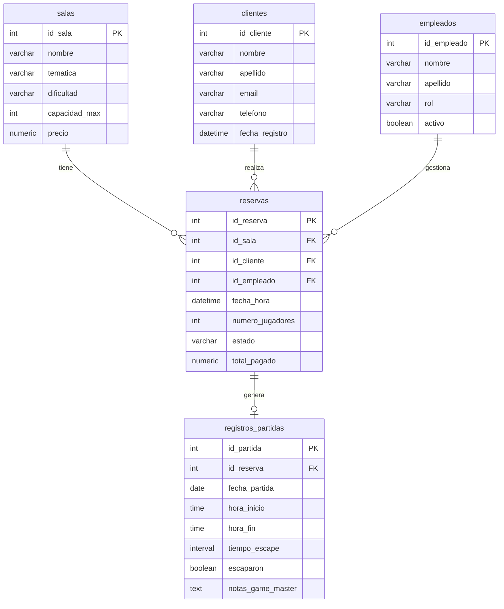

# Proyecto 2 - Grupo 3: Sistema de Gestión para Escape Rooms

## Descripción

Este proyecto consiste en el desarrollo de un sistema de gestión para un negocio de escape rooms.

La solución permite digitalizar procesos que habitualmente se gestionan de forma manual o mediante herramientas no integradas, como WhatsApp, Excel, llamadas telefónicas, agendas o notas internas.

El sistema se compone de:

- Una API REST desarrollada con FastAPI.
- Una base de datos relacional PostgreSQL gestionada mediante Supabase.
- Un frontend web desarrollado con React, TypeScript y Vite.
- Documentación interactiva mediante Swagger/OpenAPI.
- Suite de tests automatizados con Pytest.
- Gestión del proyecto mediante metodología SCRUM en Jira.
- Contenedorización y despliegue en Azure como parte del Nivel Experto.

## Contexto de negocio

El proyecto toma como referencia operativa negocios reales del sector, como The Hive Escape Room:

https://thehive.barcelona/

En muchos escape rooms pequeños y medianos, la gestión diaria depende todavía de procesos manuales o soluciones parciales. Esto puede provocar problemas como:

- Dobles reservas.
- Errores en la disponibilidad.
- Pérdida de información.
- Dificultad para gestionar cancelaciones.
- Falta de trazabilidad operativa.
- Mala organización de clientes y grupos.
- Problemas en la gestión de pagos o señales.
- Dificultad para obtener métricas reales del negocio.

El objetivo del proyecto es crear una solución más estructurada, trazable y escalable, orientada a la gestión de salas, clientes, empleados, reservas, disponibilidad y sesiones de juego.

Para consultar el análisis completo del contexto de negocio:

[docs/business-context.md](docs/business-context.md)

## Objetivo del proyecto

Desarrollar una API REST y una base de datos SQL que permitan gestionar eficientemente un negocio de escape rooms, sustituyendo procesos manuales y preparando el negocio para crecer.

El sistema busca cumplir los requisitos técnicos del briefing académico:

- Diseño de base de datos SQL.
- API REST con operaciones CRUD.
- Documentación completa de la API.
- Tests unitarios y de integración.
- Control de versiones con Git y GitHub.
- Gestión del proyecto mediante SCRUM.
- Documentación del proceso de trabajo.
- Contenedorización y despliegue como objetivos avanzados.

## Metodología de trabajo

El proyecto se gestiona mediante metodología SCRUM utilizando Jira.

Tablero Jira:

https://miguel-redondo.atlassian.net/jira/software/projects/P2G3S/boards/34/backlog

Sprints planificados:

| Sprint | Fechas | Objetivo |
|---|---|---|
| Sprint 1 - MVP Esencial | 25/05/2026 - 29/05/2026 | Construir una primera versión funcional que cumpla el Nivel Esencial del briefing. |
| Sprint 2 - Mejora, Experto y Cierre | 01/06/2026 - 04/06/2026 | Añadir funcionalidades de Nivel Medio, Avanzado y Experto, reforzar tests, documentación y preparar la entrega final. |

Documentación SCRUM:

```text
docs/scrum/
```

Dailys:

```text
docs/scrum/dailys/
```

## Tecnologías

### Backend

- Python.
- FastAPI.
- SQLAlchemy.
- Pydantic y Pydantic Settings.
- PostgreSQL.
- Supabase.
- Swagger/OpenAPI.
- Pytest.
- Logging básico.

### Frontend

- React.
- TypeScript.
- Vite.
- React Router.
- TanStack Query.
- Axios.
- Tailwind CSS.
- Lucide React.

### DevOps y despliegue

- Docker.
- Docker Compose.
- Azure Container Registry.
- Azure Web Apps.
- GitHub Actions.

### Gestión

- Git.
- GitHub.
- Jira.
- SCRUM.

## Estructura del proyecto

```text
.
├── backend/
│   ├── core/
│   │   ├── config.py
│   │   ├── database.py
│   │   └── logger.py
│   ├── models/
│   │   ├── cliente.py
│   │   ├── empleado.py
│   │   ├── reserva.py
│   │   ├── sala.py
│   │   └── sesion.py
│   ├── routers/
│   │   ├── cliente_router.py
│   │   ├── disponibilidad_router.py
│   │   ├── empleado_router.py
│   │   ├── game_router.py
│   │   ├── reserva_router.py
│   │   ├── sala_router.py
│   │   └── sesion_router.py
│   ├── schemas/
│   │   ├── cliente.py
│   │   ├── empleado.py
│   │   ├── messages.py
│   │   ├── reserva.py
│   │   ├── sala.py
│   │   └── sesion.py
│   ├── services/
│   │   ├── elevenlabs_service.py
│   │   └── ws_manager.py
│   ├── resources/
│   │   └── db/
│   │       └── script_tablas_BBDD.sql
│   ├── tests/
│   │   ├── conftest.py
│   │   ├── test_clientes.py
│   │   ├── test_health.py
│   │   ├── test_reservas.py
│   │   ├── test_salas.py
│   │   └── test_sesiones.py
│   ├── Dockerfile
│   ├── main.py
│   └── requirements.txt
├── frontend/
│   ├── src/
│   │   ├── api/
│   │   ├── components/
│   │   ├── constants/
│   │   ├── layouts/
│   │   ├── models/
│   │   ├── pages/
│   │   ├── router/
│   │   └── services/
│   ├── Dockerfile
│   ├── nginx.conf
│   ├── package.json
│   └── vite.config.ts
├── frontend-esential/
├── docs/
│   ├── business-context.md
│   └── scrum/
│       └── dailys/
├── .github/
│   └── workflows/
├── docker-compose.yml
├── docker-compose.prod.yml
└── README.md
```

## Criterio de organización

- `backend/core/`: configuración, conexión a base de datos y logging.
- `backend/models/`: modelos SQLAlchemy.
- `backend/schemas/`: validaciones y estructuras de entrada/salida con Pydantic.
- `backend/routers/`: endpoints REST y WebSocket.
- `backend/services/`: lógica de servicios externos y gestión de WebSockets.
- `backend/tests/`: tests automatizados del backend.
- `frontend/`: aplicación web principal desacoplada del backend.
- `frontend-esential/`: versión básica conservada como referencia del MVP esencial.
- `docs/`: documentación del negocio, SCRUM y seguimiento del proyecto.
- `.github/workflows/`: automatización de despliegue.

## Modelo de datos

El modelo actual contempla las siguientes entidades principales:

- `salas`
- `clientes`
- `empleados`
- `reservas`
- `registros_partidas`

Relaciones principales:

- Una sala puede tener muchas reservas.
- Un cliente puede tener muchas reservas.
- Un empleado puede gestionar muchas reservas.
- Una reserva puede estar asociada a un registro de partida.

Script SQL de referencia:

```text
backend/resources/db/script_tablas_BBDD.sql
```

## Diagrama ER


```mermaid
erDiagram
  salas {
    int id_sala PK
    varchar nombre
    varchar tematica
    varchar dificultad
    int capacidad_max
    numeric precio
  }

  clientes {
    int id_cliente PK
    varchar nombre
    varchar apellido
    varchar email
    varchar telefono
    datetime fecha_registro
  }

  empleados {
    int id_empleado PK
    varchar nombre
    varchar apellido
    varchar rol
    boolean activo
  }

  reservas {
    int id_reserva PK
    int id_sala FK
    int id_cliente FK
    int id_empleado FK
    datetime fecha_hora
    int numero_jugadores
    varchar estado
    numeric total_pagado
  }

  registros_partidas {
    int id_partida PK
    int id_reserva FK
    date fecha_partida
    time hora_inicio
    time hora_fin
    interval tiempo_escape
    boolean escaparon
    text notas_game_master
  }

  salas ||--o{ reservas : "tiene"
  clientes ||--o{ reservas : "realiza"
  empleados ||--o{ reservas : "gestiona"
  reservas ||--o| registros_partidas : "genera"
```

## Funcionalidades implementadas

### Backend

- API REST con FastAPI.
- Endpoint de salud `GET /health`.
- Swagger/OpenAPI disponible en `/docs`.
- CRUD de clientes.
- CRUD de salas.
- CRUD de empleados.
- CRUD de reservas.
- CRUD de sesiones/registros de partidas.
- Consulta de disponibilidad por sala y fecha.
- Validación para evitar reservas en fechas pasadas.
- Validación para evitar solapamiento de reservas en la misma sala.
- Manejo global de errores de validación, integridad y errores internos.
- Logging básico de peticiones HTTP.
- WebSocket para comunicación en tiempo real entre panel Game Master y sala.
- Servicio de integración con ElevenLabs para generación de audio.

### Frontend

- Aplicación React/Vite desacoplada del backend.
- Pantalla de login provisional.
- Dashboard principal.
- Gestión de salas.
- Gestión de clientes.
- Gestión de empleados.
- Gestión de reservas.
- Consulta visual de disponibilidad.
- Panel Game Master.
- Pantalla de sala para participantes.
- Comunicación en tiempo real mediante WebSocket.
- Reproducción de pistas con audio cuando la integración externa devuelve contenido.

### DevOps

- Dockerfile para backend.
- Dockerfile para frontend.
- Docker Compose para ejecución local.
- Docker Compose de referencia para imágenes de producción.
- Workflow de GitHub Actions para construir imágenes, publicarlas en Azure Container Registry y desplegarlas en Azure Web Apps.
- Workflow legacy de despliegue ZIP del backend conservado como referencia.

## Estado por niveles del briefing

### Nivel Esencial

Estado: completado.

- Base de datos con más de 3 tablas relacionadas.
- API REST con operaciones CRUD.
- Tests automatizados para endpoints principales.
- Documentación en Markdown.
- Gestión SCRUM mediante Jira.
- Variables de entorno.
- Logging básico.
- Manejo simple de excepciones.

### Nivel Medio

Estado: en progreso.

- Base de datos ampliada.
- Swagger disponible.
- Manejo de errores con códigos HTTP.
- Disponibilidad por sala y fecha.
- Exportación CSV pendiente de implementación.
- Filtrado y paginación pendientes o en planificación.

### Nivel Avanzado

Estado: parcialmente iniciado.

- Login provisional en frontend.
- Autenticación JWT real pendiente.
- Roles y permisos pendientes.
- WebSockets implementados como funcionalidad avanzada.

### Nivel Experto

Estado: en validación.

- Docker implementado.
- Docker Compose implementado.
- Despliegue en Azure en fase de validación.
- Integración externa con ElevenLabs implementada como POC/integración avanzada.
- Frontend web desacoplado implementado.

## Instalación local

Clonar el repositorio:

```bash
git clone https://github.com/Bootcamp-IA-MAD-P7/proyecto2-grupo3.git
cd proyecto2-grupo3
```

Crear entorno virtual:

```bash
python -m venv .venv
```

Activar entorno virtual en Git Bash:

```bash
source .venv/Scripts/activate
```

Instalar dependencias del backend:

```bash
pip install -r backend/requirements.txt
```

Instalar dependencias del frontend:

```bash
cd frontend
npm install
```

## Variables de entorno

El backend utiliza variables de entorno para la conexión a base de datos y servicios externos.

Archivo de referencia:

```text
backend/.env.example
```

Variables principales:

```env
DATABASE_URL=
ENVIRONMENT=development
ELEVENLABS_API_KEY=
ELEVENLABS_VOICE_ID=
ELEVENLABS_BASE_URL=
WS_PING_INTERVAL_SECONDS=30
```

Para Docker Compose se puede utilizar un archivo `.env` en la raíz del proyecto con:

```env
DATABASE_URL=
ENVIRONMENT=development
ELEVENLABS_API_KEY=
ELEVENLABS_VOICE_ID=
ELEVENLABS_BASE_URL=
WS_PING_INTERVAL_SECONDS=30
VITE_API_URL=http://localhost:8000
VITE_API_URL_WS=ws://127.0.0.1:8000/ws/sala
```

Los archivos `.env` no deben subirse al repositorio.

## Ejecución del backend

Desde la raíz del proyecto:

```bash
source .venv/Scripts/activate
cd backend
uvicorn main:app --reload
```

API:

```text
http://127.0.0.1:8000
```

Health check:

```text
GET http://127.0.0.1:8000/health
```

Respuesta esperada:

```json
{
  "status": "ok"
}
```

## Ejecución del frontend

Desde la raíz del proyecto:

```bash
cd frontend
npm install
npm run dev
```

El frontend se ejecuta normalmente en:

```text
http://127.0.0.1:5173
```

La pantalla de login actual es provisional y simula la autenticación mediante un token local. La autenticación JWT real queda pendiente para el Nivel Avanzado.

## Ejecución con Docker Compose

Desde la raíz del proyecto:

```bash
docker compose up --build
```

Servicios esperados:

```text
Backend:  http://127.0.0.1:8000
Frontend: http://127.0.0.1:3003
```

El archivo `docker-compose.prod.yml` contiene una configuración de referencia para usar imágenes publicadas en Azure Container Registry.

## Documentación de la API

FastAPI genera automáticamente la documentación interactiva mediante Swagger/OpenAPI.

Con el backend en ejecución:

```text
http://127.0.0.1:8000/docs
```

Especificación OpenAPI:

```text
http://127.0.0.1:8000/openapi.json
```

Endpoints principales:

- `GET /health`
- `/clientes/`
- `/salas/`
- `/empleados/`
- `/reservas/`
- `/sesiones/`
- `/disponibilidad/`
- `POST /juego/iniciar/{sala_id}`
- `WS /ws/sala/{sala_id}`

## Tests

La suite de tests se encuentra en:

```text
backend/tests/
```

Cubre:

- Health.
- Clientes.
- Salas.
- Reservas.
- Sesiones.

Los tests utilizan SQLite en memoria/local de pruebas y no dependen directamente de Supabase.

Ejecutar tests desde la raíz:

```bash
python -m pytest backend/tests -q
```

Salida esperada en el estado actual:

```text
42 passed
```

## Despliegue

El repositorio contiene dos workflows:

```text
.github/workflows/deploy-acr-and-webapps.yml
.github/workflows/deploy-backend.yml
```

### Workflow principal

`deploy-acr-and-webapps.yml` construye imágenes Docker de backend y frontend, las publica en Azure Container Registry y despliega ambos servicios en Azure Web Apps.

Requiere secretos de GitHub para:

- Azure login.
- Azure Container Registry.
- Resource group.
- Web App del backend.
- Web App del frontend.

### Workflow legacy

`deploy-backend.yml` conserva un flujo previo de despliegue ZIP del backend. Actualmente se mantiene como referencia histórica y no debe considerarse el flujo principal de producción.

## Estado actual del proyecto

Sprint actual:

```text
Sprint 2 - Mejora, Experto y Cierre
01/06/2026 - 04/06/2026
```

Estado funcional:

- MVP esencial completado.
- Backend CRUD funcionando.
- Supabase configurado como PostgreSQL compartido.
- Swagger operativo.
- Tests principales pasando.
- Frontend React integrado.
- Docker y Azure en fase de validación.
- WebSockets y ElevenLabs implementados, pendientes de validación final de criterios de aceptación.
- Exportación CSV, JWT real, roles/permisos y revisión final de entregables siguen pendientes dentro del Sprint 2.

## Equipo

Proyecto desarrollado por el Grupo 3 dentro del segundo proyecto académico del bootcamp.
