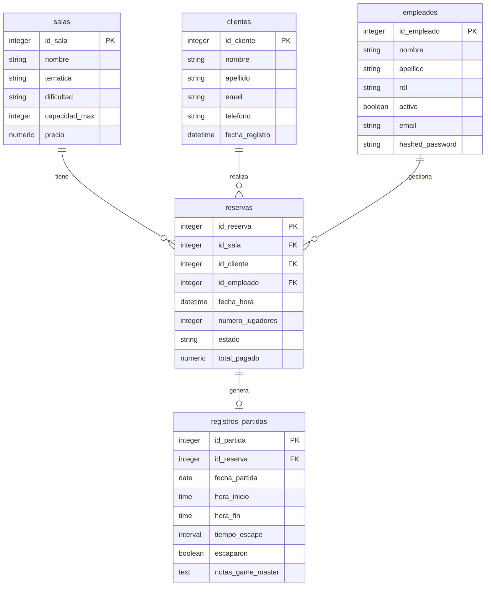

# Proyecto 2 - Grupo 3: Sistema de Gestión para Escape Rooms

API REST y aplicación web para digitalizar la gestión operativa de un negocio de escape rooms.

El proyecto forma parte del segundo proyecto académico del bootcamp y responde al briefing de crear una solución personalizada para una pequeña o mediana empresa, con base de datos SQL, API REST, documentación, tests, control de versiones y gestión ágil con SCRUM.

## Índice

- [Descripción](#descripción)
- [Contexto de negocio](#contexto-de-negocio)
- [Estado actual](#estado-actual)
- [Tecnologías](#tecnologías)
- [Estructura del proyecto](#estructura-del-proyecto)
- [Modelo de datos](#modelo-de-datos)
- [Instalación y ejecución](#instalación-y-ejecución)
- [Documentación de la API](#documentación-de-la-api)
- [Tests](#tests)
- [Docker](#docker)
- [Despliegue](#despliegue)
- [SCRUM y documentación](#scrum-y-documentación)
- [Estado de los niveles de entrega](#estado-de-los-niveles-de-entrega)

## Descripción

El sistema permite gestionar de forma centralizada las operaciones principales de un escape room:

- Salas.
- Clientes.
- Empleados.
- Reservas.
- Sesiones o partidas.
- Disponibilidad horaria.
- Autenticación de usuarios mediante JWT.
- Panel web básico para administración.
- Comunicación en tiempo real mediante WebSocket.

La aplicación sustituye procesos manuales como WhatsApp, Excel, llamadas, agendas o notas internas, reduciendo errores de disponibilidad, dobles reservas y pérdida de información.

## Contexto de negocio

El proyecto toma como referencia negocios reales del sector, como The Hive Escape Room:

[https://thehive.barcelona/](https://thehive.barcelona/)

El análisis completo del negocio, problemática, competencia y propuesta diferencial se encuentra en:

[docs/business-context.md](docs/business-context.md)

## Estado actual

Estado revisado a fecha 05/06/2026:

- Backend FastAPI funcional.
- Base de datos PostgreSQL en Supabase.
- Modelos SQLAlchemy definidos para las entidades principales.
- CRUD principal implementado.
- Validaciones de negocio en reservas.
- Manejo global de errores.
- Logging básico integrado.
- Swagger/OpenAPI disponible automáticamente.
- Autenticación JWT implementada.
- Frontend React/Vite con login y rutas protegidas.
- Exportación CSV disponible desde tablas del frontend.
- WebSocket e integración ElevenLabs incorporados como funcionalidades avanzadas.
- Docker configurado para backend y frontend.
- Workflow de GitHub Actions para despliegue en Azure.
- Suite de tests backend verificada: `42 passed`.

## Tecnologías

### Backend

- Python.
- FastAPI.
- SQLAlchemy.
- Pydantic.
- PostgreSQL.
- Supabase.
- JWT con `python-jose`.
- `bcrypt` para hash de contraseñas.
- Pytest.
- Uvicorn.

### Frontend

- React.
- Vite.
- TypeScript.
- React Router.
- TanStack Query.
- Axios.
- Tailwind CSS.
- Lucide React.

### DevOps y gestión

- Git y GitHub.
- Docker.
- Docker Compose.
- GitHub Actions.
- Azure Container Registry.
- Azure Web Apps.
- Jira con metodología SCRUM.

## Estructura del proyecto

```text
.
├── .github/
│   └── workflows/
│       └── deploy-azure.yml
├── backend/
│   ├── core/
│   │   ├── config.py
│   │   ├── database.py
│   │   ├── logger.py
│   │   └── security.py
│   ├── models/
│   │   ├── cliente.py
│   │   ├── empleado.py
│   │   ├── reserva.py
│   │   ├── sala.py
│   │   └── sesion.py
│   ├── routers/
│   │   ├── auth_router.py
│   │   ├── cliente_router.py
│   │   ├── disponibilidad_router.py
│   │   ├── empleado_router.py
│   │   ├── game_router.py
│   │   ├── reserva_router.py
│   │   ├── sala_router.py
│   │   └── sesion_router.py
│   ├── schemas/
│   ├── services/
│   ├── tests/
│   ├── .env.example
│   ├── Dockerfile
│   ├── main.py
│   └── requirements.txt
├── docs/
│   ├── business-context.md
│   └── scrum/
│       └── dailys/
├── frontend/
│   ├── public/
│   ├── src/
│   ├── .env.example
│   ├── Dockerfile
│   ├── nginx.conf
│   ├── package.json
│   └── vite.config.ts
├── frontend-esential/
├── docker-compose.yml
├── script_tablas_BBDD.sql
└── README.md
```

## Modelo de datos

El modelo principal de base de datos contempla las siguientes entidades:

- `salas`
- `clientes`
- `empleados`
- `reservas`
- `registros_partidas`

La tabla `registros_partidas` representa las sesiones o partidas jugadas asociadas a reservas.

### Mapa de relaciones

| Tabla origen | Relación | Descripción |
|---|---:|---|
| `reservas` -> `salas` | N : 1 | Una sala puede tener muchas reservas. |
| `reservas` -> `clientes` | N : 1 | Un cliente puede realizar muchas reservas. |
| `reservas` -> `empleados` | N : 1 | Un empleado puede gestionar muchas reservas. |
| `registros_partidas` -> `reservas` | 1 : 1 | Una reserva puede generar una partida. |

### Diagrama ER


```mermaid
erDiagram
  salas {
    integer id_sala PK
    string nombre
    string tematica
    string dificultad
    integer capacidad_max
    numeric precio
  }

  clientes {
    integer id_cliente PK
    string nombre
    string apellido
    string email
    string telefono
    datetime fecha_registro
  }

  empleados {
    integer id_empleado PK
    string nombre
    string apellido
    string rol
    boolean activo
    string email
    string hashed_password
  }

  reservas {
    integer id_reserva PK
    integer id_sala FK
    integer id_cliente FK
    integer id_empleado FK
    datetime fecha_hora
    integer numero_jugadores
    string estado
    numeric total_pagado
  }

  registros_partidas {
    integer id_partida PK
    integer id_reserva FK
    date fecha_partida
    time hora_inicio
    time hora_fin
    interval tiempo_escape
    boolean escaparon
    text notas_game_master
  }

  salas ||--o{ reservas : "tiene"
  clientes ||--o{ reservas : "realiza"
  empleados ||--o{ reservas : "gestiona"
  reservas ||--o| registros_partidas : "genera"
```

## Instalación y ejecución

### 1. Clonar el repositorio

```bash
git clone https://github.com/Bootcamp-IA-MAD-P7/proyecto2-grupo3.git
cd proyecto2-grupo3
```

### 2. Crear y activar entorno virtual

En Git Bash:

```bash
python -m venv .venv
source .venv/Scripts/activate
```

En PowerShell:

```powershell
python -m venv .venv
.\.venv\Scripts\Activate.ps1
```

### 3. Instalar dependencias backend

```bash
pip install -r backend/requirements.txt
```

### 4. Configurar variables de entorno

Crear un archivo `.env` en la raíz del proyecto tomando como referencia `backend/.env.example`.

Variables principales:

```text
DATABASE_URL=
ENVIRONMENT=development
JWT_SECRET_KEY=
JWT_ALGORITHM=HS256
JWT_ACCESS_TOKEN_EXPIRE_MINUTES=30
JWT_REFRESH_TOKEN_EXPIRE_DAYS=7
ELEVENLABS_API_KEY=
ELEVENLABS_VOICE_ID=
ELEVENLABS_BASE_URL=
WS_PING_INTERVAL_SECONDS=30
VITE_API_URL=http://localhost:8000/api
VITE_API_URL_WS=ws://127.0.0.1:8000/api/ws/sala
```

Nota académica: durante el desarrollo del proyecto se ha trabajado con variables compartidas para facilitar la colaboración del equipo. En un proyecto real, las credenciales sensibles no deben subirse al repositorio y deben gestionarse mediante secretos de entorno.

### 5. Ejecutar backend

```bash
cd backend
uvicorn main:app --reload
```

Backend local:

[http://127.0.0.1:8000](http://127.0.0.1:8000)

Health check:

[http://127.0.0.1:8000/health](http://127.0.0.1:8000/health)

### 6. Ejecutar frontend

```bash
cd frontend
npm install
npm run dev
```

Frontend local:

[http://127.0.0.1:3003](http://127.0.0.1:3003)

## Documentación de la API

FastAPI genera automáticamente la documentación interactiva.

Con el backend arrancado:

- Swagger UI: [http://127.0.0.1:8000/docs](http://127.0.0.1:8000/docs)
- OpenAPI JSON: [http://127.0.0.1:8000/openapi.json](http://127.0.0.1:8000/openapi.json)

Las rutas principales están agrupadas por tags:

- `Auth`
- `Clientes`
- `Salas`
- `Empleados`
- `Reservas`
- `Sesiones`
- `Disponibilidad`
- `Health`

Las rutas de negocio bajo `/api` están protegidas mediante JWT. Primero debe generarse un token desde:

```text
POST /api/auth/login
```

## Tests

La suite de tests se encuentra en:

```text
backend/tests/
```

Ejecutar tests desde la raíz del proyecto:

```bash
python -m pytest backend/tests -q
```

Última verificación local:

```text
42 passed
```

Los tests validan:

- Health check.
- CRUD de clientes.
- CRUD de salas.
- CRUD de reservas.
- CRUD de sesiones.
- Validaciones de datos.
- Manejo de errores.
- Casos de recursos inexistentes.

## Docker

El proyecto incluye Docker para backend y frontend.

Construir imágenes:

```bash
docker compose build
```

Levantar contenedores:

```bash
docker compose up -d
```

Servicios:

- Backend: [http://127.0.0.1:8000](http://127.0.0.1:8000)
- Frontend: [http://127.0.0.1:3003](http://127.0.0.1:3003)

Última verificación local:

- `docker compose build`: correcto.
- `docker compose up -d`: correcto.
- `GET /health`: correcto.
- Frontend Nginx en `3003`: correcto.

## Despliegue

El despliegue está definido mediante GitHub Actions:

```text
.github/workflows/deploy-azure.yml
```

El workflow:

- Construye imagen Docker del backend.
- Construye imagen Docker del frontend.
- Publica imágenes en Azure Container Registry.
- Configura variables de entorno en Azure Web Apps.
- Despliega frontend como contenedor principal.
- Despliega backend como contenedor sidecar.
- Reinicia la Web App.

Para que el despliegue funcione, GitHub debe tener configurados los secretos necesarios:

- `AZURE_CREDENTIALS`
- `ACR_USERNAME`
- `ACR_PASSWORD`
- `ACR_LOGIN_SERVER`
- `AZURE_WEBAPP_NAME`
- `AZURE_RESOURCE_GROUP`
- `DATABASE_URL`
- `ENVIRONMENT`
- `JWT_SECRET_KEY`
- `JWT_ALGORITHM`
- `JWT_ACCESS_TOKEN_EXPIRE_MINUTES`
- `JWT_REFRESH_TOKEN_EXPIRE_DAYS`
- `VITE_API_URL`
- `VITE_API_URL_WS`
- `ELEVENLABS_API_KEY`
- `ELEVENLABS_VOICE_ID`
- `ELEVENLABS_BASE_URL`
- `WS_PING_INTERVAL_SECONDS`

## SCRUM y documentación

El proyecto se ha gestionado mediante SCRUM en Jira.

Tablero Jira:

[Proyecto P2G3S en Jira](https://miguel-redondo.atlassian.net/jira/software/projects/P2G3S/boards/34/backlog)

Documentación de seguimiento:

```text
docs/scrum/dailys/
```

El repositorio incluye dailys del Sprint 1 y Sprint 2, usadas para documentar avance, bloqueos, decisiones técnicas y próximos pasos.

Retrospectiva del proyecto:

[docs/scrum/retrospective.md](docs/scrum/retrospective.md)

## Estado de los niveles de entrega

### Nivel Esencial

Estado: completado.

- Base de datos con más de 3 tablas relacionadas.
- API REST con CRUD básico.
- Tests para endpoints principales.
- Documentación en Markdown.
- Gestión del proyecto con Jira.
- Variables de entorno.
- Logging básico.
- Manejo de excepciones.

### Nivel Medio

Estado: avanzado.

- Base de datos con 5 o más tablas.
- Swagger interactivo.
- Errores HTTP controlados.
- Exportación CSV desde frontend.
- Disponibilidad horaria como consulta de negocio.

### Nivel Avanzado

Estado: avanzado.

- Autenticación JWT implementada.
- Rutas protegidas.
- Login frontend integrado.
- Refresh token implementado.
- WebSockets incorporados.

### Nivel Experto

Estado: parcialmente completado.

- Docker configurado y validado.
- Frontend React disponible.
- Workflow de despliegue en Azure preparado.
- Integración externa ElevenLabs incorporada.

## Equipo

Proyecto desarrollado por el Grupo 3 dentro del segundo proyecto académico del bootcamp.
