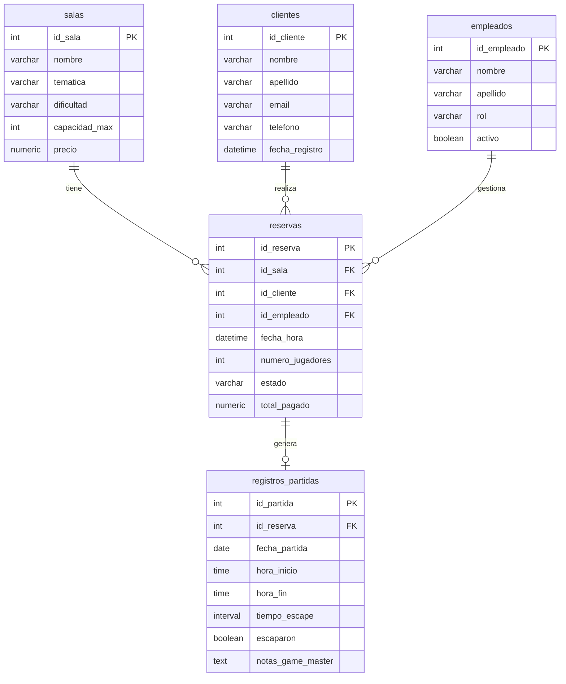

# Proyecto 2 - Grupo 3: Sistema de Gestion para Escape Rooms

## Descripcion

Este proyecto desarrolla un sistema de gestion para un negocio de escape rooms. La solucion permite digitalizar procesos que suelen gestionarse manualmente o con herramientas no integradas, como WhatsApp, Excel, llamadas telefonicas, agendas o notas internas.

El sistema esta formado por:

- API REST desarrollada con FastAPI.
- Base de datos PostgreSQL gestionada mediante Supabase.
- Frontend web desarrollado con React, TypeScript y Vite.
- Documentacion interactiva mediante Swagger/OpenAPI.
- Tests automatizados con Pytest.
- Gestion SCRUM mediante Jira.
- Contenedorizacion con Docker y despliegue en Azure.

Aplicacion desplegada:

```text
https://escape-room-h4bghreyhpfwexfs.spaincentral-01.azurewebsites.net/login
```

## Contexto de negocio

El proyecto toma como referencia operativa negocios reales del sector, como The Hive Escape Room:

```text
https://thehive.barcelona/
```

En muchos escape rooms pequenos y medianos, la gestion diaria depende de procesos manuales o soluciones parciales. Esto puede provocar:

- Dobles reservas.
- Errores de disponibilidad.
- Perdida de informacion.
- Dificultad para gestionar cancelaciones.
- Falta de trazabilidad operativa.
- Mala organizacion de clientes y grupos.
- Problemas en pagos o senales.
- Dificultad para obtener metricas reales del negocio.

El objetivo es crear una solucion estructurada, trazable y escalable para gestionar salas, clientes, empleados, reservas, disponibilidad y sesiones de juego.

Analisis completo del contexto de negocio:

```text
docs/business-context.md
```

## Objetivo del proyecto

Desarrollar una API REST y una base de datos SQL que permitan gestionar eficientemente un negocio de escape rooms, sustituyendo procesos manuales y preparando el negocio para crecer.

Requisitos tecnicos trabajados:

- Diseno de base de datos SQL.
- API REST con operaciones CRUD.
- Documentacion completa de la API.
- Tests unitarios y de integracion.
- Control de versiones con Git y GitHub.
- Gestion del proyecto mediante SCRUM.
- Documentacion del proceso de trabajo.
- Contenedorizacion y despliegue como objetivos de nivel experto.

## Metodologia de trabajo

El proyecto se gestiona mediante SCRUM en Jira.

Tablero Jira:

```text
https://miguel-redondo.atlassian.net/jira/software/projects/P2G3S/boards/34/backlog
```

Sprints:

| Sprint | Fechas | Objetivo |
|---|---|---|
| Sprint 1 - MVP Esencial | 25/05/2026 - 29/05/2026 | Construir una primera version funcional que cumpla el Nivel Esencial del briefing. |
| Sprint 2 - Mejora, Experto y Cierre | 01/06/2026 - 05/06/2026 | Completar mejoras, despliegue, documentacion, validacion final y entregables. |

Documentacion SCRUM:

```text
docs/scrum/
```

Dailys:

```text
docs/scrum/dailys/
```

Retrospectiva:

```text
docs/scrum/retrospective.md
```

## Tecnologias

### Backend

- Python.
- FastAPI.
- SQLAlchemy.
- Pydantic y Pydantic Settings.
- PostgreSQL.
- Supabase.
- Swagger/OpenAPI.
- Pytest.
- Logging basico.

### Frontend

- React.
- TypeScript.
- Vite.
- React Router.
- TanStack Query.
- Axios.
- Tailwind CSS.
- Lucide React.

### DevOps y despliegue

- Docker.
- Docker Compose.
- Azure Container Registry.
- Azure Web Apps.
- GitHub Actions.

### Gestion

- Git.
- GitHub.
- Jira.
- SCRUM.

## Estructura del proyecto

```text
.
|-- backend/
|   |-- core/
|   |-- models/
|   |-- routers/
|   |-- schemas/
|   |-- services/
|   |-- resources/db/
|   |-- tests/
|   |-- Dockerfile
|   |-- main.py
|   `-- requirements.txt
|-- frontend/
|   |-- src/
|   |-- Dockerfile
|   |-- nginx.conf
|   |-- package.json
|   `-- vite.config.ts
|-- frontend-esential/
|-- docs/
|   |-- business-context.md
|   `-- scrum/
|       `-- dailys/
|-- .github/workflows/
|-- docker-compose.yml
|-- docker-compose.prod.yml
`-- README.md
```

## Modelo de datos

Entidades principales:

- `salas`
- `clientes`
- `empleados`
- `reservas`
- `registros_partidas`

Relaciones principales:

- Una sala puede tener muchas reservas.
- Un cliente puede tener muchas reservas.
- Un empleado puede gestionar muchas reservas.
- Una reserva puede estar asociada a un registro de partida.

Script SQL de referencia:

```text
backend/resources/db/script_tablas_BBDD.sql
```

## Diagrama ER


```mermaid
erDiagram
  salas {
    int id_sala PK
    varchar nombre
    varchar tematica
    varchar dificultad
    int capacidad_max
    numeric precio
  }

  clientes {
    int id_cliente PK
    varchar nombre
    varchar apellido
    varchar email
    varchar telefono
    datetime fecha_registro
  }

  empleados {
    int id_empleado PK
    varchar nombre
    varchar apellido
    varchar rol
    boolean activo
  }

  reservas {
    int id_reserva PK
    int id_sala FK
    int id_cliente FK
    int id_empleado FK
    datetime fecha_hora
    int numero_jugadores
    varchar estado
    numeric total_pagado
  }

  registros_partidas {
    int id_partida PK
    int id_reserva FK
    date fecha_partida
    time hora_inicio
    time hora_fin
    interval tiempo_escape
    boolean escaparon
    text notas_game_master
  }

  salas ||--o{ reservas : "tiene"
  clientes ||--o{ reservas : "realiza"
  empleados ||--o{ reservas : "gestiona"
  reservas ||--o| registros_partidas : "genera"
```

## Funcionalidades implementadas

### Backend

- API REST con FastAPI.
- Endpoint de salud `GET /health`.
- Documentacion Swagger/OpenAPI disponible en `/docs`.
- CRUD de clientes.
- CRUD de salas.
- CRUD de empleados.
- CRUD de reservas.
- CRUD de sesiones/registros de partidas.
- Consulta de disponibilidad por sala y fecha.
- Validaciones de negocio para reservas.
- Manejo global de errores de validacion, integridad y errores internos.
- Logging basico de peticiones HTTP.
- WebSocket para comunicacion en tiempo real entre panel Game Master y sala.
- Servicio de integracion con ElevenLabs.

### Frontend

- Aplicacion React/Vite desacoplada del backend.
- Pantalla de login.
- Dashboard principal.
- Gestion de salas.
- Gestion de clientes.
- Gestion de empleados.
- Gestion de reservas.
- Consulta visual de disponibilidad.
- Panel Game Master.
- Pantalla de sala para participantes.
- Comunicacion en tiempo real mediante WebSocket.

### DevOps

- Dockerfile para backend.
- Dockerfile para frontend.
- Docker Compose para ejecucion local.
- Docker Compose de referencia para produccion.
- Workflow de GitHub Actions para construir imagenes, publicarlas en Azure Container Registry y desplegarlas en Azure Web Apps.

## Estado por niveles del briefing

### Nivel Esencial

Estado: completado.

- Base de datos con mas de 3 tablas relacionadas.
- API REST con operaciones CRUD.
- Tests automatizados para endpoints principales.
- Documentacion en Markdown.
- Gestion SCRUM mediante Jira.
- Variables de entorno.
- Logging basico.
- Manejo simple de excepciones.

### Nivel Medio

Estado: completado parcialmente.

- Base de datos ampliada.
- Swagger disponible.
- Manejo de errores con codigos HTTP.
- Disponibilidad por sala y fecha.
- Funcionalidades de consulta y gestion desde frontend.

### Nivel Avanzado

Estado: completado parcialmente.

- Login y autenticacion en la aplicacion.
- WebSockets implementados como funcionalidad avanzada.
- Roles/permisos completos quedan como mejora futura si no se validan dentro del cierre.

### Nivel Experto

Estado: implementado y en validacion final.

- Docker implementado.
- Docker Compose implementado.
- Despliegue en Azure.
- Frontend web implementado.
- Integracion externa con ElevenLabs.

## Instalacion local

Clonar el repositorio:

```bash
git clone https://github.com/Bootcamp-IA-MAD-P7/proyecto2-grupo3.git
cd proyecto2-grupo3
```

Crear entorno virtual:

```bash
python -m venv .venv
```

Activar entorno virtual en Git Bash:

```bash
source .venv/Scripts/activate
```

Instalar dependencias del backend:

```bash
pip install -r backend/requirements.txt
```

Instalar dependencias del frontend:

```bash
cd frontend
npm install
```

## Variables de entorno

El proyecto utiliza variables de entorno para credenciales y configuracion sensible. Los archivos `.env` no deben subirse al repositorio.

Archivo de referencia:

```text
backend/.env.example
```

Variables principales:

```env
DATABASE_URL=
ENVIRONMENT=development
ELEVENLABS_API_KEY=
ELEVENLABS_VOICE_ID=
ELEVENLABS_BASE_URL=
WS_PING_INTERVAL_SECONDS=30
JWT_SECRET_KEY=
JWT_ALGORITHM=HS256
JWT_ACCESS_TOKEN_EXPIRE_MINUTES=30
JWT_REFRESH_TOKEN_EXPIRE_DAYS=7
```

En Azure, estas variables se configuran como App Settings / Environment variables.

## Ejecucion del backend

Desde la raiz del proyecto:

```bash
source .venv/Scripts/activate
cd backend
uvicorn main:app --reload
```

API local:

```text
http://127.0.0.1:8000
```

Health check:

```text
GET http://127.0.0.1:8000/health
```

## Ejecucion del frontend

Desde la raiz del proyecto:

```bash
cd frontend
npm install
npm run dev
```

Frontend local:

```text
http://127.0.0.1:5173
```

## Ejecucion con Docker Compose

Desde la raiz del proyecto:

```bash
docker compose up --build
```

Servicios esperados:

```text
Backend:  http://127.0.0.1:8000
Frontend: http://127.0.0.1:3003
```

## Documentacion de la API

FastAPI genera automaticamente la documentacion interactiva mediante Swagger/OpenAPI.

Swagger local:

```text
http://127.0.0.1:8000/docs
```

OpenAPI local:

```text
http://127.0.0.1:8000/openapi.json
```

Endpoints principales:

- `GET /health`
- `/api/clientes/`
- `/api/salas/`
- `/api/empleados/`
- `/api/reservas/`
- `/api/sesiones/`
- `/api/disponibilidad/`
- `POST /api/juego/iniciar/{sala_id}`
- `WS /api/ws/sala/{sala_id}`

## Tests

La suite de tests se encuentra en:

```text
backend/tests/
```

Cubre:

- Health.
- Clientes.
- Salas.
- Reservas.
- Sesiones.

Ejecutar tests desde la raiz:

```bash
python -m pytest backend/tests -q
```

Resultado de validacion final:

```text
42 passed
```

La suite utiliza una base de datos SQLite de pruebas y un override de autenticacion en `backend/tests/conftest.py` para validar los endpoints protegidos sin depender del login real ni de la base de datos desplegada.

## Despliegue

Workflow principal:

```text
.github/workflows/deploy-azure.yml
```

El workflow construye imagenes Docker de backend y frontend, las publica en Azure Container Registry y despliega la aplicacion en Azure Web Apps.

Aplicacion desplegada:

```text
https://escape-room-h4bghreyhpfwexfs.spaincentral-01.azurewebsites.net/login
```

## Entregables

| Entregable | Ubicacion / evidencia |
|---|---|
| Diagrama ER de la base de datos | Seccion `Diagrama ER` de este README y script SQL en `backend/resources/db/script_tablas_BBDD.sql`. |
| Repositorio GitHub con codigo fuente | `https://github.com/Bootcamp-IA-MAD-P7/proyecto2-grupo3` |
| Documentacion de la API | Swagger/OpenAPI en `/docs` con backend en ejecucion. |
| Suite de tests | `backend/tests/`, ejecutable con `python -m pytest backend/tests -q`. |
| Documento de retrospectiva | `docs/scrum/retrospective.md`. |
| Tablero Kanban/SCRUM | Jira: `https://miguel-redondo.atlassian.net/jira/software/projects/P2G3S/boards/34/backlog`. |

## Estado actual del proyecto

Estado final de entrega:

- MVP esencial completado.
- Backend CRUD implementado.
- Base de datos PostgreSQL/Supabase configurada.
- Swagger operativo.
- Frontend React integrado.
- Docker y despliegue en Azure implementados.
- Jira documentado con epicas, historias, subtareas y seguimiento SCRUM.
- Dailys y retrospectiva documentadas en `docs/scrum/`.

## Equipo

Proyecto desarrollado por el Grupo 3 dentro del segundo proyecto academico del bootcamp.
